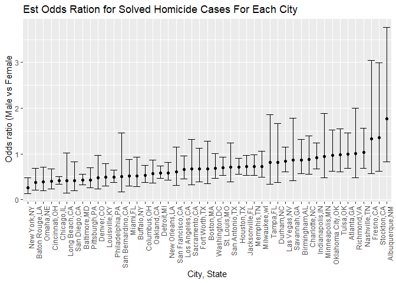
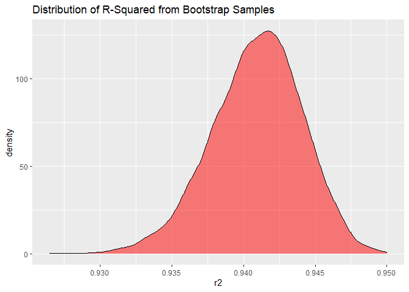
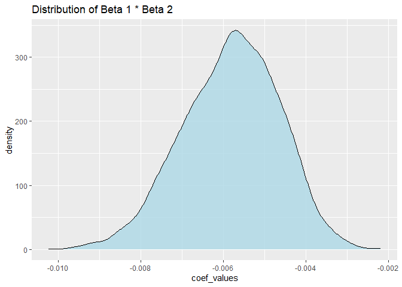
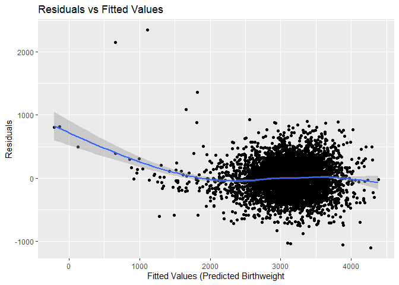
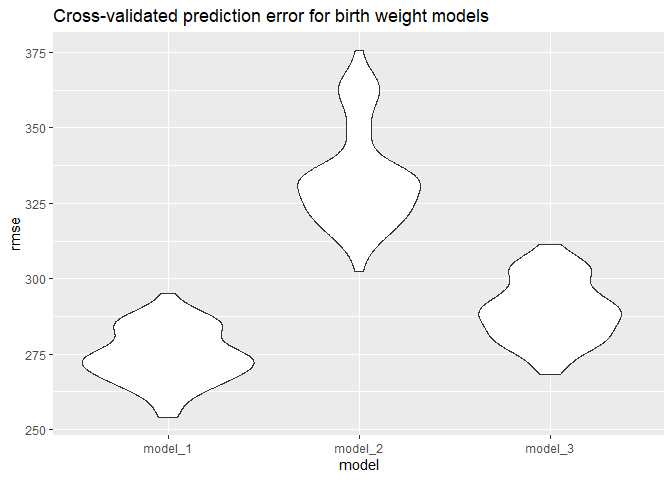

p8105_hw6
================
Maliha Safdar
2025-11-29

``` r
library(tidyverse)
```

    ## ── Attaching core tidyverse packages ──────────────────────── tidyverse 2.0.0 ──
    ## ✔ dplyr     1.1.4     ✔ readr     2.1.5
    ## ✔ forcats   1.0.0     ✔ stringr   1.5.1
    ## ✔ ggplot2   4.0.0     ✔ tibble    3.3.0
    ## ✔ lubridate 1.9.4     ✔ tidyr     1.3.1
    ## ✔ purrr     1.1.0     
    ## ── Conflicts ────────────────────────────────────────── tidyverse_conflicts() ──
    ## ✖ dplyr::filter() masks stats::filter()
    ## ✖ dplyr::lag()    masks stats::lag()
    ## ℹ Use the conflicted package (<http://conflicted.r-lib.org/>) to force all conflicts to become errors

``` r
library(modelr)
library(broom)
```

    ## 
    ## Attaching package: 'broom'
    ## 
    ## The following object is masked from 'package:modelr':
    ## 
    ##     bootstrap

``` r
library(p8105.datasets)
weather_df = p8105.datasets::weather_df
set.seed(123)
```

### Problem 1

`First, we will go ahead and import the data.`

``` r
### importing the dataset

homicide_daf = read.csv("homicide-data.csv")
```

`Next, create city_state and solved variable. The solved variable will be binary so any case that is not closed with arrest will be 0. The victim_age will be converted to numeric using mutate function. We will use the filter function to ensure that Dallas, Phoenix, Kansas City and Tulsa are removed from city_state variable as well as only including White and Black race in victim_race.`

``` r
### creating city_state variable, making binary variable for disposition, omitting Dallas, Phoenix, Kansas City and Tulsa,selecting white+black for victime_race and contverting victime_age to numeric.

homicide_df = homicide_daf |>
  mutate(
    city_state = str_c(city,state, sep = ","),
    solved = if_else(disposition == "Closed by arrest", 1, 0),
    victim_age = as.numeric(victim_age)
    ) |>
  filter(
    !city_state %in% c("Dallas,TX", "Phoenix,AZ", "Kansas City,MO","Tulsa,AL"),
    victim_race %in% c ("White", "Black")
  )
```

    ## Warning: There was 1 warning in `mutate()`.
    ## ℹ In argument: `victim_age = as.numeric(victim_age)`.
    ## Caused by warning:
    ## ! NAs introduced by coercion

`Now we will fit a logistic regression  with solved and unsolved homicide cases as outcome and victime age, sex and race as predictors. For this model we will use Baltimore, MD from the city_state variable.`

``` r
#filter for Baltimore, MD and create a variable for it.

baltimore <- homicide_df |>
  filter(city_state%in% c("Baltimore,MD"))

# create the logistical model

log_model <- glm(solved ~ victim_age + victim_sex + victim_race, data = baltimore, family = binomial())

log_model |>
  tidy(conf.int = TRUE) |>
  filter(term == "victim_sexMale") |>
  mutate(
    OR = exp(estimate),
    CI_low = exp(conf.low),
    CI_high = exp(conf.high)
  ) |>
  select(OR, CI_low, CI_high) |>
  knitr::kable(digits = 3)
```

|    OR | CI_low | CI_high |
|------:|-------:|--------:|
| 0.426 |  0.324 |   0.558 |

`When comparing males versus females, we see that the odds ratio for solving homicide cases is 0.426 with a confidence interval between 0.324 and 0.558.`

`Next we will perform logistic regression for every city in the dataset, and extract the odds ratio and CIs. We will compare males vs female victims.`

``` r
cities <- homicide_df |>
  group_by(city_state) |>
  nest() |>
  mutate(
    model = map(data, ~ glm(solved ~ victim_age + victim_sex + victim_race, data= .x, family = binomial ())),
    results = map(model, ~ broom::tidy(.x, conf.int = TRUE))
  ) |>
  unnest(results) |>
  filter(term == "victim_sexMale") |>
  mutate(
    OR = exp(estimate),
    CI_low = exp(conf.low),
    CI_high = exp(conf.high)
  ) |>
  select(city_state, OR, CI_low, CI_high)

cities |>
  knitr::kable(digits = 3)
```

| city_state        |    OR | CI_low | CI_high |
|:------------------|------:|-------:|--------:|
| Albuquerque,NM    | 1.767 |  0.825 |   3.762 |
| Atlanta,GA        | 1.000 |  0.680 |   1.458 |
| Baltimore,MD      | 0.426 |  0.324 |   0.558 |
| Baton Rouge,LA    | 0.381 |  0.204 |   0.684 |
| Birmingham,AL     | 0.870 |  0.571 |   1.314 |
| Boston,MA         | 0.674 |  0.353 |   1.277 |
| Buffalo,NY        | 0.521 |  0.288 |   0.936 |
| Charlotte,NC      | 0.884 |  0.551 |   1.391 |
| Chicago,IL        | 0.410 |  0.336 |   0.501 |
| Cincinnati,OH     | 0.400 |  0.231 |   0.667 |
| Columbus,OH       | 0.532 |  0.377 |   0.748 |
| Denver,CO         | 0.479 |  0.233 |   0.962 |
| Detroit,MI        | 0.582 |  0.462 |   0.734 |
| Durham,NC         | 0.812 |  0.382 |   1.658 |
| Fort Worth,TX     | 0.669 |  0.394 |   1.121 |
| Fresno,CA         | 1.335 |  0.567 |   3.048 |
| Houston,TX        | 0.711 |  0.557 |   0.906 |
| Indianapolis,IN   | 0.919 |  0.678 |   1.241 |
| Jacksonville,FL   | 0.720 |  0.536 |   0.965 |
| Las Vegas,NV      | 0.837 |  0.606 |   1.151 |
| Long Beach,CA     | 0.410 |  0.143 |   1.024 |
| Los Angeles,CA    | 0.662 |  0.457 |   0.954 |
| Louisville,KY     | 0.491 |  0.301 |   0.784 |
| Memphis,TN        | 0.723 |  0.526 |   0.984 |
| Miami,FL          | 0.515 |  0.304 |   0.873 |
| Milwaukee,wI      | 0.727 |  0.495 |   1.054 |
| Minneapolis,MN    | 0.947 |  0.476 |   1.881 |
| Nashville,TN      | 1.034 |  0.681 |   1.556 |
| New Orleans,LA    | 0.585 |  0.422 |   0.812 |
| New York,NY       | 0.262 |  0.133 |   0.485 |
| Oakland,CA        | 0.563 |  0.364 |   0.867 |
| Oklahoma City,OK  | 0.974 |  0.623 |   1.520 |
| Omaha,NE          | 0.382 |  0.199 |   0.711 |
| Philadelphia,PA   | 0.496 |  0.376 |   0.650 |
| Pittsburgh,PA     | 0.431 |  0.263 |   0.696 |
| Richmond,VA       | 1.006 |  0.483 |   1.994 |
| San Antonio,TX    | 0.705 |  0.393 |   1.238 |
| Sacramento,CA     | 0.669 |  0.326 |   1.314 |
| Savannah,GA       | 0.867 |  0.419 |   1.780 |
| San Bernardino,CA | 0.500 |  0.166 |   1.462 |
| San Diego,CA      | 0.413 |  0.191 |   0.830 |
| San Francisco,CA  | 0.608 |  0.312 |   1.155 |
| St. Louis,MO      | 0.703 |  0.530 |   0.932 |
| Stockton,CA       | 1.352 |  0.626 |   2.994 |
| Tampa,FL          | 0.808 |  0.340 |   1.860 |
| Tulsa,OK          | 0.976 |  0.609 |   1.544 |
| Washington,DC     | 0.690 |  0.465 |   1.012 |

`Making a plot to show the estimated ORs and CI for each city.`

``` r
cities |>
  ggplot(aes(x = reorder(city_state, OR), y = OR)) +
  geom_point() +
  geom_errorbar(aes(ymin = CI_low, ymax = CI_high)) +
  labs(
    title = "Est Odds Ration for Solved Homicide Cases For Each City",
    x = "City, State",
    y = " Odds ratio (Male vs Female)"
  ) +
  theme(axis.text.x = element_text(angle = 90, hjust = 1))
```

<!-- -->
`In the plot above, we can visualize the Odds Ratio of solved homicide cases in every city of our dataset. The ORs vary between 0.5 to 1.5. In cities like NYC, Baton Rouge and Omaha the OR is less than 1 which indicates that in those cities female homicide cases are solved more than males. In cities like Albuquerque, Stockon, and Fresno which have ORs greater than 1, indicates that male homicide cases are solved more than females.`

### Problem 2

`We will fit a simple linear regression model using weather_df. The tmax is the output(response) and tmin and prcp are predictors.`

``` r
# Create the function
weather_bootstrap <- function(df) {
 
   bootstrap_df <- df |> sample_frac(replace = TRUE)
   
   fit <- lm(tmax ~ tmin + prcp, data = bootstrap_df)
   
   r2 <- glance(fit)$r.squared #extract r2
   
   coefs <- tidy(fit) #extract coeffcients
   
   beta1 <- coefs$estimate[coefs$term == "tmin"]
   beta2 <- coefs$estimate[coefs$term == "prcp"]
   
   tibble(
     r2 = r2,
     coef_values = beta1 * beta2
   )
}

# Taking bootstrap samples

weather_bootstrap_results <- map_df(1:5000, ~ weather_bootstrap(weather_df))
```

``` r
weather_bootstrap_results |>
  ggplot(aes( x = r2)) +
  geom_density(fill = "red", alpha = 0.5) +
  labs(
    title = "Distribution of R-Squared from Bootstrap Samples"
  )
```

<!-- -->

``` r
weather_bootstrap_results |>
  ggplot(aes(x = coef_values)) +
  geom_density(fill = "lightblue", alpha = 0.8) +
  labs(
    title = "Distribution of Beta 1 * Beta 2"
  )
```

<!-- -->

`Now we'll calculate the 95% confidence intervals for r-squared and Beta1*Beta2.`

``` r
conf_intervals <- weather_bootstrap_results |>
  summarise(
    r2_low = quantile(r2, 0.025),
    r2_high = quantile(r2, 0.975),
    beta_low = quantile(coef_values, 0.025),
    beta_high = quantile(coef_values, 0.975)
  )

knitr::kable(conf_intervals)
```

|    r2_low |   r2_high |   beta_low |  beta_high |
|----------:|----------:|-----------:|-----------:|
| 0.9342923 | 0.9466149 | -0.0082307 | -0.0037089 |

### Problem 3

`First, we will import the dataset.`

``` r
birthweight = read.csv("birthweight.csv")
```

`Now we will clean the dataset.`

``` r
birthweight_clean <- birthweight |>
  mutate(
    babysex = 
      case_match(
        babysex, 
        1 ~ "male",
        2 ~ "female"
      ),
    babysex = fct_infreq(babysex),
    frace = 
      case_match(
        frace, 
        1 ~ "White",
        2 ~ "Black",
        3 ~ "Asian",
        4 ~ "Puerto Rican",
        8 ~ "Other",
        9 ~ "Unknown"
      ),
    frace = fct_infreq(frace),
    mrace = 
      case_match(
        mrace, 
        1 ~ "White",
        2 ~ "Black",
        3 ~ "Asian",
        4 ~ "Puerto Rican",
        8 ~ "Other",
        9 ~ "Unknown"),
    mrace = fct_infreq(mrace),
    malform = as.logical(malform)) |>
  drop_na()
```

`Next we will make a regression model for birthweight.`

``` r
birthweight_model <- lm( bwt ~ babysex + bhead + blength + delwt + fincome + frace+ gaweeks + malform + menarche + mheight + momage + mrace + parity + pnumlbw + pnumsga + ppbmi + ppwt + smoken + wtgain, data = birthweight_clean)

birthweight_model
```

    ## 
    ## Call:
    ## lm(formula = bwt ~ babysex + bhead + blength + delwt + fincome + 
    ##     frace + gaweeks + malform + menarche + mheight + momage + 
    ##     mrace + parity + pnumlbw + pnumsga + ppbmi + ppwt + smoken + 
    ##     wtgain, data = birthweight_clean)
    ## 
    ## Coefficients:
    ##       (Intercept)      babysexfemale              bhead            blength  
    ##        -6265.3914            28.7073           130.7781            74.9536  
    ##             delwt            fincome         fraceBlack  fracePuerto Rican  
    ##            4.1007             0.2898            14.3313           -46.9962  
    ##        fraceAsian         fraceOther            gaweeks        malformTRUE  
    ##           21.2361             4.2969            11.5494             9.7650  
    ##          menarche            mheight             momage         mraceBlack  
    ##           -3.5508             9.7874             0.7593          -151.4354  
    ## mracePuerto Rican         mraceAsian             parity            pnumlbw  
    ##          -56.4787           -91.3866            95.5411                 NA  
    ##           pnumsga              ppbmi               ppwt             smoken  
    ##                NA             4.3538            -3.4716            -4.8544  
    ##            wtgain  
    ##                NA

`Now we will plot the residuals against the fitted values.`

``` r
birthweight_df <- birthweight_clean |>
  add_predictions(birthweight_model) |>
  add_residuals(birthweight_model)
  

birthweight_df |>
  ggplot(aes(x = pred, y = resid)) +
  geom_point() +
  geom_smooth() +
  labs(
    title = "Residuals vs Fitted Values",
    x = "Fitted Values (Predicted Birthweight",
    y = "Residuals"
  )
```

    ## `geom_smooth()` using method = 'gam' and formula = 'y ~ s(x, bs = "cs")'

<!-- -->

`A baby's birth weight is affected by many variables. Some of the baby's characteristics such as sex, head circumference, and length at birth directly affect the growth and development while the mother's health also plays a role in the baby's birth weight. Some of those variables include pre-pregnancy BMI, weight, age and height. Furtermore, socioeconomic factors such as family income, mother and father's race are also predictors of birth weight. Lastly, certain lifestyle and health measurements like gestational age, smoking behavior and parity affect fetal growth and determine the baby's birthweight.`

`Now we will compare the model to two other models.`

``` r
model_1 <- lm( bwt ~ babysex + bhead + blength + delwt + fincome + frace+ gaweeks + malform + menarche + mheight + momage + mrace + parity + pnumlbw + pnumsga + ppbmi + ppwt + smoken + wtgain, data = birthweight_clean)

model_2 <- lm(bwt ~ blength + gaweeks, data = birthweight_clean)

model_3 <- lm(bwt ~ bhead * blength * babysex, data = birthweight_clean)
```

`Now we will show the comparisons using cross-validated prediction error.`

``` r
cross_validation <- crossv_mc(birthweight_df, 100) |>
  mutate(
    train = map(train, as_tibble),
    test = map(test, as_tibble)
  )

cross_validation <- cross_validation |>
  mutate(
    model_1 = map(train, \(df) lm(bwt ~ babysex + bhead + blength + delwt + fincome + frace+ gaweeks + malform + menarche + mheight + momage + mrace + parity + pnumlbw + pnumsga + ppbmi + ppwt + smoken + wtgain, data = df)),
    model_2 = map(train, \(df) lm(bwt ~ blength + gaweeks, data = df)),
    model_3 = map(train, \(df) lm(bwt ~ bhead * blength * babysex, data = df)),
    rmse_model_1 = map2_dbl(model_1, test, \(mod,df) rmse(model = mod, data = df)),
    rmse_model_2 = map2_dbl(model_2, test, \(mod,df) rmse(model = mod, data = df)),
    rmse_model_3 = map2_dbl(model_3, test, \(mod,df) rmse(model = mod, data = df))
    
  )
```

`Now we will plot the output of each model.`

``` r
cross_validation |>
  select(starts_with("rmse")) |>
  pivot_longer(
    everything(),
    names_to = "model",
    values_to = "rmse",
    names_prefix = "rmse_") |>
  mutate(
    model = fct_inorder(model)) |>
  ggplot(aes(x = model, y = rmse)) + 
  geom_violin() +
  labs( title = "Cross-validated prediction error for birth weight models")
```

<!-- -->
`The above violin plots displays the three models that predict birth weight in babies. Model 1 uses all the variables that include the baby, mother and socioeconomic measurements which in turn gives the lowest RMSE which means that it makes accurate predictions on birth weight. Model 2 uses  only two variables, the baby's length and mother's gestational age which is why it has high RMSE values indicating that it does not make accurate predictions on baby's weight. Model 3 includes baby's features like the length, sex and head size which performs better and has lower RMSE values.`
